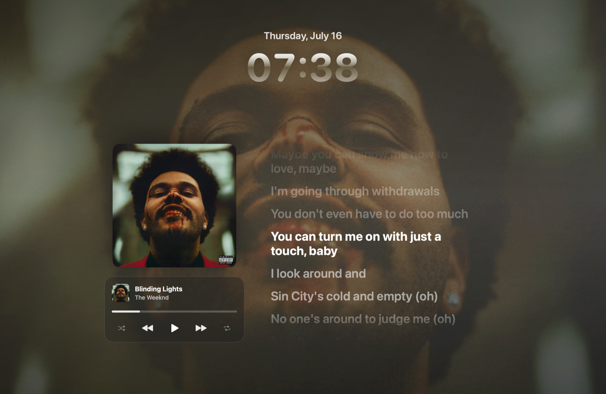
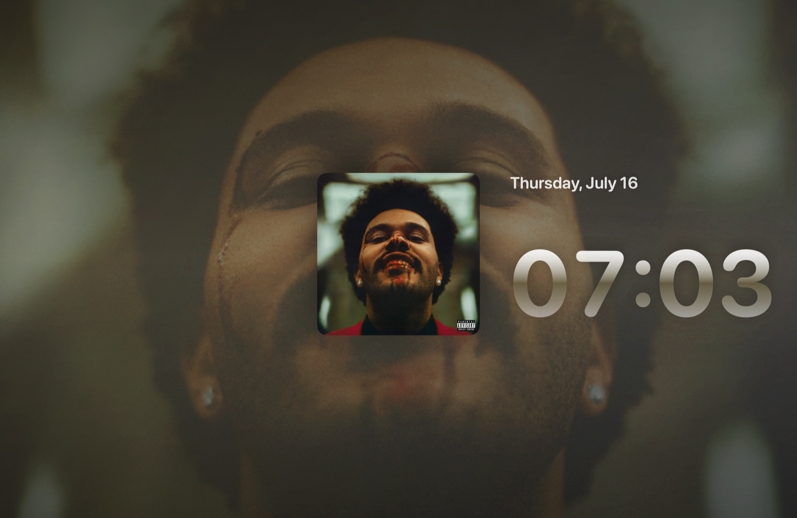

# MuseSaver

A free, open-source macOS clone of the *MuseSaver* lock screen app. MuseSaver lives in
your menu bar and shows a fullscreen, iOS-style lock screen for whatever is
currently playing on Spotify: blurred album art, a big clock, the track title and
artist, and smoothly scrolling, time-synced lyrics.

Built entirely with **Swift, AppKit, and SwiftUI** — no third-party dependencies.



*Tap the album art to declutter — the clock grows to fill the artwork's height:*



---

## Features

- Fullscreen, borderless lock screen window that floats above everything.
- Blurred album-art background with a darkening overlay, just like the iOS lock screen.
- Large clock in the system rounded font, with date.
- Time-synced lyrics from [lrclib.net](https://lrclib.net) that highlight and scroll
  with playback. Tracks without synced lyrics simply show nothing.
- **Tap the album art** to declutter — track info, controls, and lyrics fade out,
  leaving just the artwork and clock. Tap again to bring them back.
- Dismiss with **Escape** or by clicking anywhere outside the album art.
- **⌥⌘L global hotkey** summons the lock screen from anywhere.
- Optionally appears automatically the moment you **unlock your Mac** (toggle in the
  menu: "Show When Mac Unlocks"). macOS does not permit apps to draw on the secure
  lock screen itself, so unlock-time is the closest supported moment.
- Song changes crossfade (artwork + background color are cached per track and the
  previous art stays up until the new art arrives — no black flash).
- Spotify sign-in via **OAuth 2.0 Authorization Code flow with PKCE** — no client
  secret is stored. The refresh token is kept in the macOS **Keychain**.
- Polls Spotify only while the lock screen is open.

---

## 1. Register a Spotify app

1. Go to the [Spotify Developer Dashboard](https://developer.spotify.com/dashboard)
   and click **Create app**.
2. Give it any name and description.
3. Under **Redirect URIs**, add exactly:

   ```
   http://127.0.0.1:8888/callback
   ```

4. For **Which API/SDKs are you planning to use?**, select **Web API**.
5. Save, then open the app's **Settings** and copy the **Client ID**.

> MuseSaver uses PKCE, so you do **not** need the client secret.

### Provide the Client ID to MuseSaver

Either edit `Sources/MuseSaver/Spotify/SpotifyConfig.swift` and replace
`YOUR_SPOTIFY_CLIENT_ID`:

```swift
return "YOUR_SPOTIFY_CLIENT_ID"   // ← paste your Client ID here
```

…or export it as an environment variable before launching (this takes precedence):

```bash
export SPOTIFY_CLIENT_ID=xxxxxxxxxxxxxxxxxxxxxxxx
```

---

## 2. Build & run

### From the command line

```bash
cd MuseSaver
swift run
```

### In Xcode

```bash
open Package.swift
```

Then select the **MuseSaver** scheme and press **Run** (⌘R).

The app has no Dock icon — look for the moon-and-stars icon in the **menu bar**.

---

## 3. Use it

1. Click the menu bar icon → **Connect Spotify…**. Your browser opens the Spotify
   consent screen; approve it and you'll see a "MuseSaver connected" page. You can close
   that tab.
2. Start playing something in Spotify.
3. Click the menu bar icon → **Show Lock Screen** (or press ⌘L from the menu).
4. Tap the album art to declutter; press **Escape** or click outside the art to dismiss.

---

## Entitlements & permissions

As a plain Swift Package executable, MuseSaver runs **unsandboxed** and needs no
entitlements file — it can make outbound network requests and reach the Keychain
freely.

If you later wrap it in a sandboxed `.app` bundle, add these entitlements:

| Entitlement | Why |
|---|---|
| `com.apple.security.network.client` | Talk to the Spotify & lrclib APIs |
| `com.apple.security.network.server` | Run the local `127.0.0.1:8888` OAuth callback listener |
| Keychain Sharing / `keychain-access-groups` | Store the refresh token |

---

## Project layout

```
Sources/MuseSaver/
├── main.swift                          # Entry point (accessory app)
├── AppDelegate.swift                   # Wires everything together
├── MenuBarController.swift             # NSStatusItem + menu
├── Support/
│   ├── Keychain.swift                  # Refresh-token storage
│   └── Extensions.swift                # Base64URL, form encoding, notifications
├── Spotify/
│   ├── SpotifyConfig.swift             # Client ID, redirect URI, scopes
│   ├── LocalCallbackServer.swift       # Catches the OAuth redirect
│   ├── SpotifyAuth.swift               # PKCE flow + token refresh
│   ├── SpotifyModels.swift             # Codable API models
│   └── SpotifyAPI.swift                # currently-playing endpoint
├── Lyrics/
│   └── LyricsService.swift             # lrclib fetch + LRC parse + cache
└── LockScreen/
    ├── NowPlayingModel.swift           # Polling + playback estimation store
    ├── LockScreenWindow.swift          # Borderless key window
    ├── LockScreenWindowController.swift # Window lifecycle
    └── LockScreenView.swift            # SwiftUI lock screen UI
```

---

## Notes & limitations

- The transport controls are **fully functional**: play/pause, next/previous, shuffle,
  repeat (off → playlist → track), and click-to-seek on the progress bar. They use the
  `user-modify-playback-state` scope. Note that Spotify requires a **Premium** account
  for playback control via the Web API — on a free account the buttons will silently
  do nothing (the API returns 403).
- Requires an active Spotify session on some device; the Web API reports what *that*
  account is playing.
- Lyrics come from lrclib's community database — coverage varies by track.

## License

MIT. Do whatever you like.
